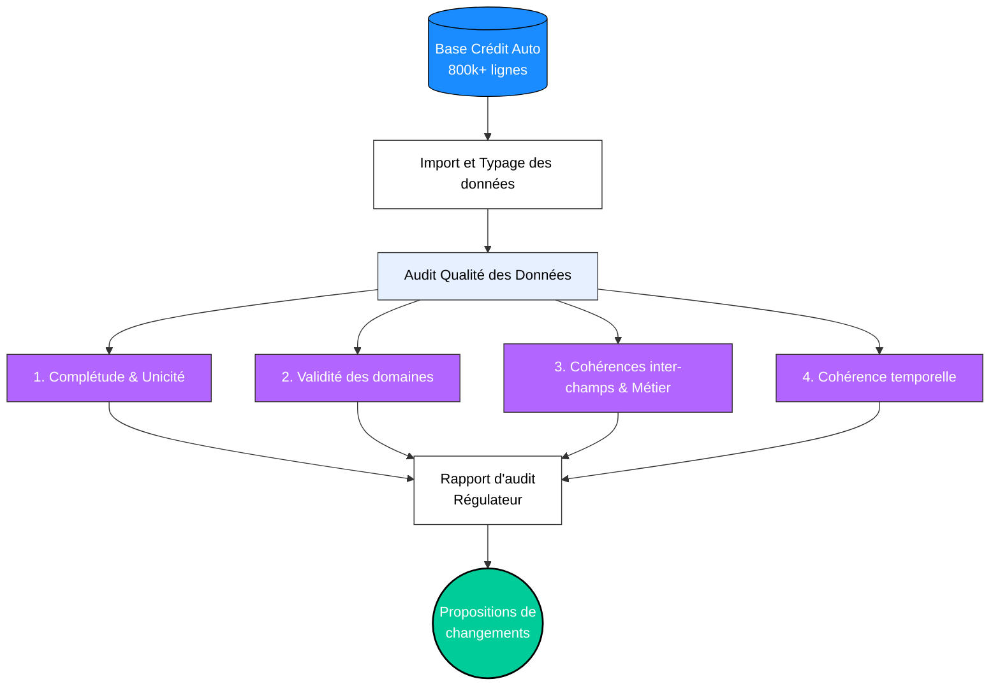

# Data Quality Audit : Retail Auto Credit Portfolio


## 📝 Project Overview
Acting as Data Analysts within the risk department of **"CREDIT AUTO EUROPE"**, our objective was to perform a comprehensive, regulatory-grade **Data Quality Audit** on a retail auto credit database containing over 800,000 credit contracts and 28 variables ahead of an on-site European regulatory inspection.

The goal is to provide a rigorous and automated audit trail evaluating risk governance, accounting standards (IFRS 9 / Basel Committee), and financial data integrity.



## 🎯 Audit Scope and Quality Dimensions

The audit is structured around the 6 regulatory data quality dimensions:
1. **Completeness :**
   * Identification of missing values (`NA`), null indicators, and blank entries across all fields.
3. **Uniqueness :**
   * Primary key (`loan_id`) uniqueness testing, multi-column duplicates, and 100% duplicate row detection.
4. **Validity :**
   * Verification of univariate domains and ranges against the official regulatory data dictionary (ISO country codes, borrower demographics, credit scores, interest rates, and loan terms).
5. **Cross-Field Consistency :** Relational checks across features :
   * Financial arithmetic: $\text{Loan Amount} = \text{Vehicle Price} - \text{Down Payment}$.
   * Loan-to-Value sanity: $\text{LTV} = \frac{\text{Loan Amount}}{\text{Vehicle Price}}$.
   * Physical plausibility: Vehicle condition ("Neuf" vs. "Occasion") against mileage and age.
5. **Accuracy & Business Plausibility :** 
   * Regulatory alignment (CRR Art. 178 / EBA): Cross-validation of default status (`default_flag`) vs. arrears (`days_past_due >= 90`).
   * Financial actuarial formulas: Theoretical vs. observed monthly installment (`monthly_installment`).
   * Socio-professional plausibility: Retirement age thresholds, minimum legal working age vs. seniority, and extreme low-income/high-debt patterns.
6. **Freshness & Temporal Consistency :**
   * Loan origination period constraints (2020–2022).
   * Chronological order between employment start dates and loan origination dates.
   * Consistency between calculated career duration and reported seniority (`job_seniority_years`).

## 🛠️ Technologies & Tools
* **Language:** R
* **Environment:** RStudio / R Markdown.
* **Core Packages:** `tidyverse` (`dplyr`, `ggplot2`, `readr`), `lubridate` (date parsing), `pacman` (package management), `knitr` (executive tables).

## 📂 Repository Structure
* `Projet_Lillian_Enzo.Rmd`: The main automated R Markdown audit script containing all data wrangling, verification logic, and reporting code.
* `Audit_Qualite_Donnees_CreditAuto.pdf`: The finalized formal executive audit report delivered to the Risk Directorate.
* `dataset_credit_auto_retail_europe.csv`: The audit dataset (800k+ retail auto credit files).
* `dictionnaire_donnees.pdf`: The official regulatory data dictionary and business specifications.

## 🚀 How to Reproduce the Analysis?
1. Clone this repository:
   ```bash
   git clone [https://github.com/your-username/your-repo-name.git](https://github.com/your-username/your-repo-name.git)

🌍 Note : The final PDF report Projet_Sans_Code.pdf is written in French. However, I would be more than happy to discuss the methodology, the code, or the results in English! Feel free to reach out.
