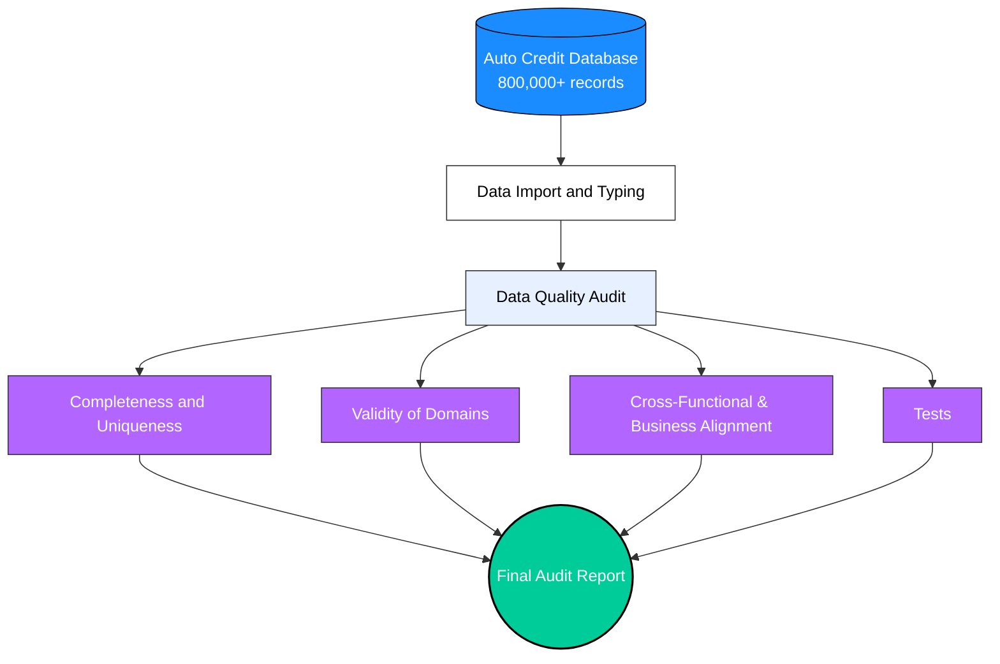

# Data Quality Audit : Retail Auto Credit Portfolio

## 📝 Project Overview
Acting as Data Analysts within the risk department of **"CREDIT AUTO EUROPE"**, our objective was to perform a comprehensive, regulatory-grade **Data Quality Audit** on a retail auto credit database containing over 800,000 credit contracts and 28 variables ahead of an on-site European regulatory inspection.

The goal is to provide a rigorous and automated audit trail evaluating risk governance, accounting standards (IFRS 9 / Basel Committee), and financial data integrity.

## 🏗️ Overall Architecture

*(Overview of the data structure and analysis process)*

```mermaid 
graph TD
    %% Source
    A[(Auto Credit Database <br/> 800,000+ records)]:::blue --> B[Data Import and Typing]:::white

    %% Audit des 6 dimensions
    B --> C[Data Quality Audit]:::light
    
    C --> D[Completeness and Uniqueness]:::purple
    C --> E[Validity of Domains]:::purple
    C --> F[Cross-Functional & Business Alignment]:::purple
    C --> G[Tests]:::purple

    %% Rapport
    D --> H((Final Audit Report)):::green
    E --> H
    F --> H
    G --> H


    %% Styles
    classDef blue fill:#1a8cff,stroke:#000,stroke-width:1px,color:#fff;
    classDef white fill:#ffffff,stroke:#333,stroke-width:1px,color:#000;
    classDef light fill:#e6f0ff,stroke:#333,stroke-width:1px,color:#000;
    classDef purple fill:#b366ff,stroke:#333,stroke-width:1px,color:#fff;
    classDef green fill:#00cc99,stroke:#000,stroke-width:2px,color:#fff;
```

## 🎯 Audit Scope and Quality Dimensions

The audit is structured around the 7 specific quality and risk dimensions coded in the analysis:

1. **Completeness:** 
   * Detection of missing values (`NA`) and blank/empty string entries across all columns .
2. **Uniqueness:** 
   * Identification of multi-column duplicate rows and primary key (`loan_id`) conflicts or overlaps .
3. **Validity:** 
   * Verification of values against the data dictionary domains, including `loan_id` format ("AUTO" + 7 digits), borrower age bounds (18-80), accepted country/status lists, and interest rate thresholds .
4. **Cross-Field Consistency:** 
   * Financial arithmetic: Validating that $\text{Loan Amount} = \text{Vehicle Price} - \text{Down Payment}$ and $\text{LTV} = \frac{\text{Loan Amount}}{\text{Vehicle Price}}$ .
   * Actuarial checks: Comparing the reported monthly installment against the theoretical amortization formula .
   * Regulatory logic: Validating the default status (`default_flag`) against the 90-day arrears threshold (`days_past_due`) .
   * Physical & Professional logic: Verifying vehicle condition ("Neuf" having 0 years and <100 km) and employment age logic (e.g., no retirees under 55) .
5. **Accuracy & Plausibility:** 
   * Flagging extreme business outliers, such as net incomes over €50k, vehicle prices over €300k, or abnormally high mileage for used cars .
6. **Solvency (Risk Assessment):** 
   * Financial health checks detecting if the monthly installment exceeds the net income, or if the total debt ratio crosses critical thresholds (35%, 60%, or 100%) .
7. **Freshness & Temporal Consistency:** 
   * Verifying that loan origination dates fall within the expected 2020–2022 production window .
   * Ensuring chronological logic, such as employment starting before the loan origination, and reconciling calculated career duration against declared job seniority .

## 🛠️ Technologies & Tools
* **Language:** R
* **Environment:** RStudio.
* **Core Packages:** `tidyverse` (`dplyr`, `ggplot2`), `knitr`, and `kableExtra` for executive summary tables.

## 📂 Repository Structure
* `Rapport_Projet_Lillian_Enzo.R`: The automated R audit script containing all data wrangling, validation flags, statistical tests (Chi-square, Wilcoxon), and ggplot2 visual reporting.
* `credit_auto_retail_europe.csv`: The audit dataset of over 802,800 retail auto credit files.
* `dictionnaire donnees_Projet_Etude_R.pdf`: The official data dictionary guiding the validity thresholds.

🌍 Note : The final PDF report TBH.pdf is written in French. However, I would be more than happy to discuss the methodology, the code, or the results in English! Feel free to reach out.
